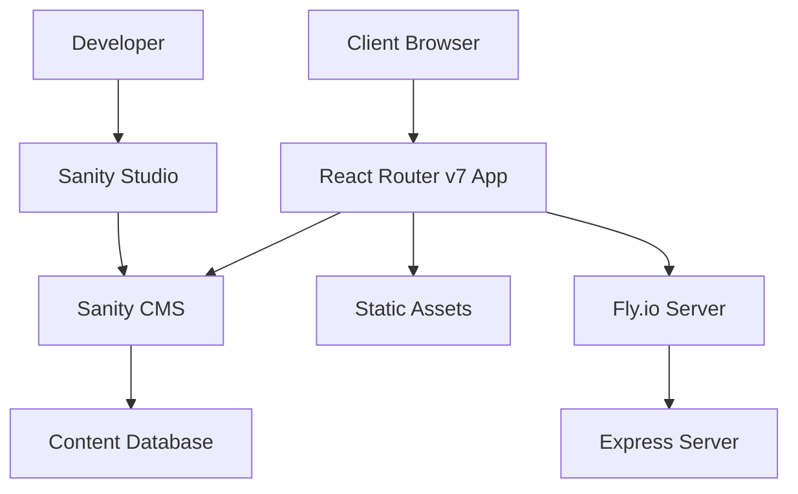

# Walz Website Architecture

## 🏗️ System Overview

The Walz website is built as a modern full-stack React application using React Router v7 (formerly Remix) with a headless CMS architecture.



## 🧩 Core Architecture Components

### Frontend Application
- **Framework**: React Router v7 (SSR + Client-side routing)
- **Language**: TypeScript with strict mode
- **Styling**: Tailwind CSS with custom design system
- **State Management**: React Router loaders + React state
- **UI Components**: Radix UI primitives + custom components

### Content Management
- **CMS**: Sanity headless CMS
- **Studio**: Embedded Sanity Studio at `/studio`
- **Data Fetching**: GROQ queries with React Router loaders
- **Type Safety**: Auto-generated TypeScript types

### Infrastructure
- **Hosting**: Fly.io with Docker containers
- **CDN**: Sanity image optimization
- **Monitoring**: Sentry error tracking + Plausible analytics
- **Security**: Honeypot protection + rate limiting

## 📁 Directory Structure

```
walz/
├── app/                        # Main application code
│   ├── components/            # Reusable UI components
│   │   ├── ui/               # Base UI primitives
│   │   └── *.tsx            # Feature components
│   ├── routes/               # File-based routing
│   │   ├── _index/          # Homepage
│   │   ├── aufnahme+/       # Admission pages (layout route)
│   │   ├── aktuelles/       # News section
│   │   └── *.tsx           # Other routes
│   ├── sanity/              # CMS integration
│   │   ├── schema/          # Content type definitions
│   │   ├── types.ts         # Generated TypeScript types
│   │   └── *.ts            # CMS utilities
│   ├── styles/              # Global CSS
│   ├── utils/               # Shared utilities
│   └── root.tsx            # Root application component
├── public/                  # Static assets
├── server/                  # Express server setup
├── docs/                   # Project documentation
└── tests/                  # E2E and unit tests
```

## 🛣️ Routing Architecture

### Flat Routes Convention
The project uses React Router's flat routes with the following patterns:

```
routes/
├── _index/                 # / (homepage)
├── aufnahme+/             # /aufnahme (layout route)
│   └── _index.tsx         # /aufnahme (index)
├── aktuelles_.beitraege+/ # /aktuelles/beitraege (layout)
│   ├── _index.tsx         # /aktuelles/beitraege
│   └── $slug.tsx         # /aktuelles/beitraege/:slug
└── ueber-uns+/           # /ueber-uns (layout)
    ├── _index.tsx        # /ueber-uns
    └── philosophie+/     # /ueber-uns/philosophie (nested layout)
```

### Route Patterns
- `+` suffix: Layout routes (shared UI)
- `_` prefix: Index routes
- `$` prefix: Dynamic parameters
- `.` separator: URL segments

### Data Loading Strategy
```typescript
// Route-level data loading
export async function loader() {
  const data = await loadQuery<QueryType>(groqQuery)
  return QuerySchema.parse(data)
}

// Component consumption
export default function RouteComponent() {
  const data = useLoaderData<typeof loader>()
  return <div>{/* render data */}</div>
}
```

## 🎨 Design System Architecture

### Tailwind Configuration
```typescript
// tailwind.config.ts
export default {
  theme: {
    extend: {
      fontFamily: {
        sans: ['Museo Sans', 'fallback'],
        condensed: ['Museo Sans Condensed', 'fallback']
      },
      colors: {
        primary: 'hsl(var(--primary))',
        secondary: 'hsl(var(--secondary))',
        // ... CSS custom properties
      }
    }
  }
}
```

### Component Variants
```typescript
// Using class-variance-authority for consistent variants
const buttonVariants = cva(
  'base-styles',
  {
    variants: {
      variant: {
        default: 'bg-primary text-primary-foreground',
        outline: 'border border-input bg-background'
      },
      size: {
        default: 'h-10 px-4 py-2',
        sm: 'h-9 px-3'
      }
    }
  }
)
```

### Typography Scale
- **Display**: mega (80px), h1-h6 (56px-16px)
- **Body**: 2xl-2xs (32px-12px)
- **Utilities**: caption, button text

## 📊 Data Architecture

### Sanity CMS Schema

```typescript
// Content Types
- post: Blog articles and news
- event: School events and activities  
- person: Staff and teacher profiles
- year: Academic year/class information
- schoolYear: Administrative year data
- costs: Tuition and fee information
- curriculum: Educational program (singleton)
- testimonial: Student/parent reviews
- home-hero: Homepage hero content
```

### GROQ Queries
```groq
// Example: Fetch posts with author info
*[_type == "post" && published == true] {
  title,
  slug,
  publishedAt,
  excerpt,
  "author": author->name,
  "categories": categories[]->title
} | order(publishedAt desc)
```

### Type Generation
```bash
# Automatic type generation from Sanity schema
sanity typegen generate
# Creates app/sanity/types.ts with full TypeScript definitions
```

## 🔒 Security Architecture

### Form Protection
```typescript
// Honeypot anti-spam
import { honeypot } from '#app/utils/honeypot.server.ts'

export async function action({ request }) {
  const formData = await request.formData()
  honeypot.check(formData) // Throws if spam detected
  // ... process form
}
```

### Rate Limiting
```typescript
// Express middleware
import rateLimit from 'express-rate-limit'

const limiter = rateLimit({
  windowMs: 15 * 60 * 1000, // 15 minutes
  max: 100 // limit each IP to 100 requests per windowMs
})
```

### Content Security Policy
- Strict CSP headers for XSS prevention  
- Trusted sources for scripts and styles
- Inline script protection with nonces

## ⚡ Performance Architecture

### Code Splitting
```typescript
// Automatic route-based splitting
const LazyRoute = lazy(() => import('./heavy-component'))

// Component-level splitting for large features
const AdminPanel = lazy(() => import('./admin/AdminPanel'))
```

### Image Optimization
```typescript
// Sanity CDN with automatic optimization
import imageUrlBuilder from '@sanity/image-url'

const urlFor = (source) =>
  imageUrlBuilder(sanityConfig)
    .image(source)
    .auto('format') // WebP/AVIF when supported
    .fit('max')
    .quality(85)
```

### Caching Strategy
- **Static assets**: Long-term browser caching
- **API responses**: Sanity CDN caching
- **Build artifacts**: Aggressive caching with cache busting

## 🚀 Build Architecture

### Vite Build System
```typescript
// vite.config.ts
export default defineConfig({
  plugins: [
    react(),
    tsconfigPaths(), // Path alias support
    sentryVitePlugin() // Error tracking
  ],
  build: {
    target: 'es2022',
    rollupOptions: {
      output: {
        manualChunks: {
          vendor: ['react', 'react-dom'],
          sanity: ['@sanity/client', '@sanity/image-url']
        }
      }
    }
  }
})
```

### Docker Deployment
```dockerfile
# Multi-stage build for optimization
FROM node:22-alpine AS builder
WORKDIR /app
COPY package*.json ./
RUN npm ci --only=production

FROM node:22-alpine AS runtime  
COPY --from=builder /app/node_modules ./node_modules
COPY . .
EXPOSE 8080
CMD ["npm", "start"]
```

## 🔄 Development Workflow

### Type Safety Pipeline
1. **Sanity schema** → Auto-generate types
2. **GROQ queries** → Zod validation schemas  
3. **Route loaders** → Type-safe data consumption
4. **Components** → Strict TypeScript checking

### Testing Architecture
```typescript
// E2E with Playwright
test('navigation works', async ({ page }) => {
  await page.goto('/')
  await page.click('nav a[href="/aufnahme"]')
  await expect(page).toHaveURL('/aufnahme')
})

// Unit tests with Vitest
test('utility functions', () => {
  expect(formatDate('2023-01-01')).toBe('1. Januar 2023')
})
```

## 📈 Monitoring & Observability

### Error Tracking
```typescript
// Sentry integration
import { withSentry } from '@sentry/remix'

export default withSentry(App, {
  wrapWithErrorBoundary: true,
  captureUnhandledRejections: true
})
```

### Analytics
```html
<!-- Privacy-focused analytics -->
<script 
  defer 
  data-domain="walz.at" 
  src="https://plausible.io/js/script.js"
></script>
```

### Health Checks
```typescript
// Built-in health monitoring
export async function loader() {
  // Database connectivity check
  // External service checks  
  // Resource usage monitoring
  return { status: 'healthy', timestamp: new Date() }
}
```

This architecture provides a solid foundation for a modern, scalable web application with excellent developer experience and production reliability.